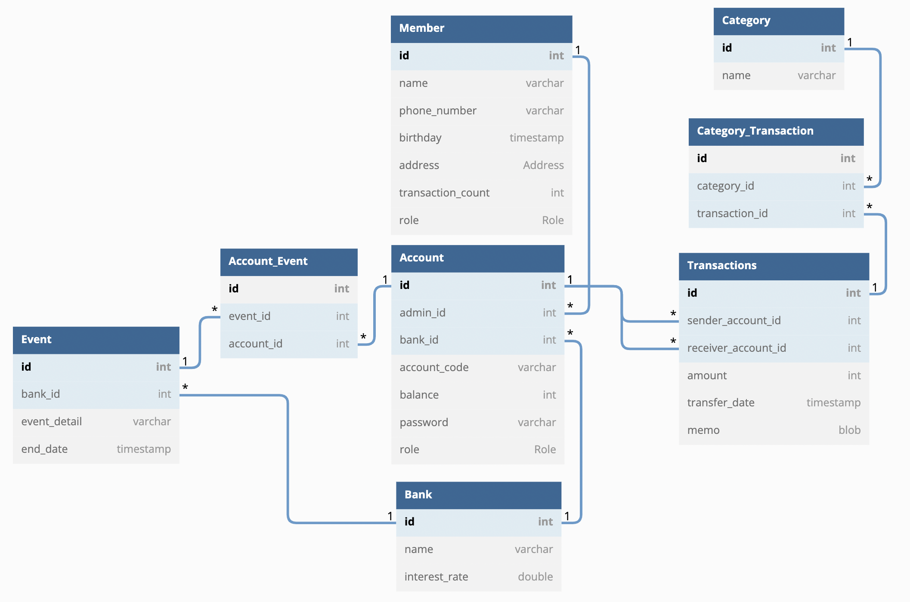
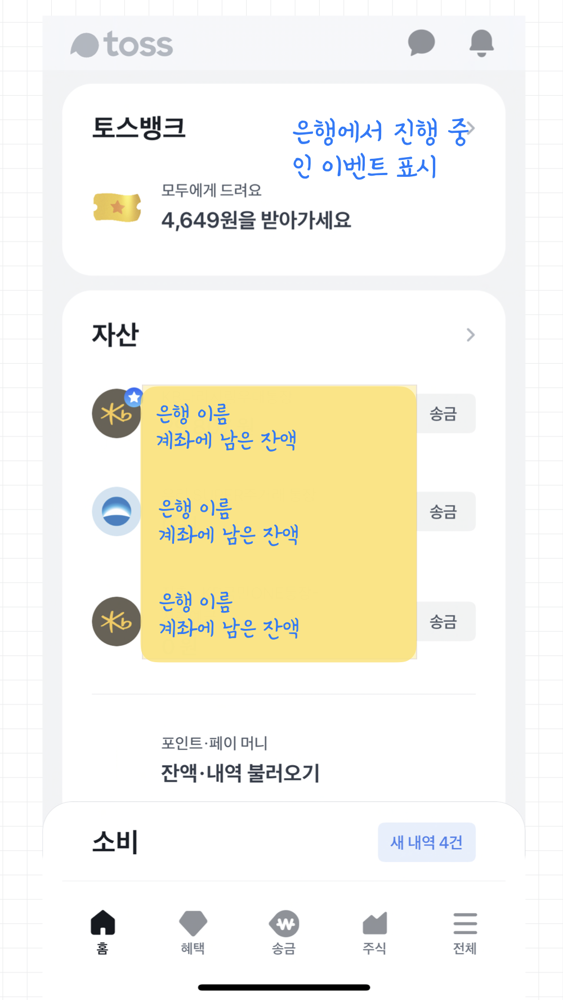
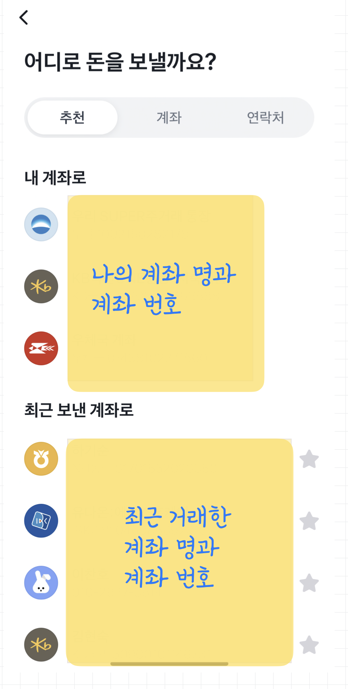
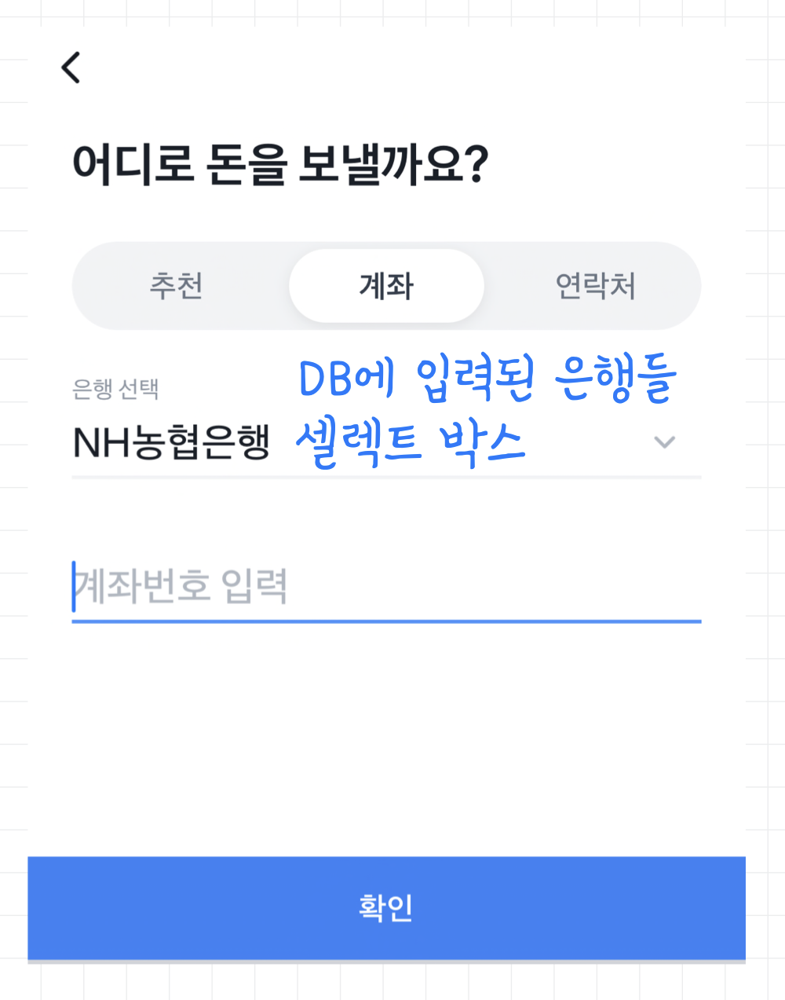
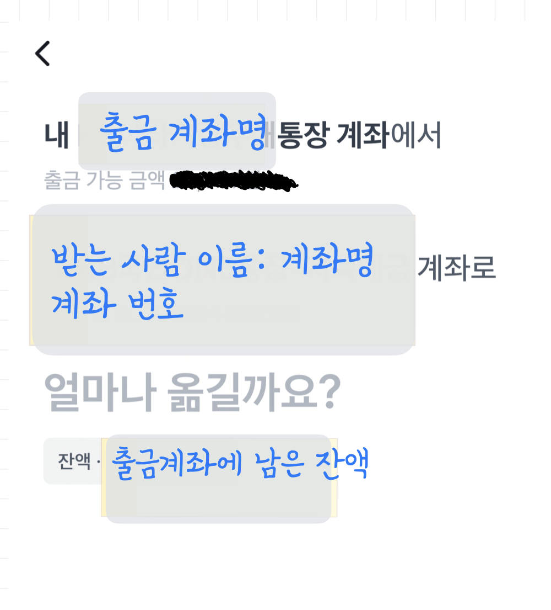
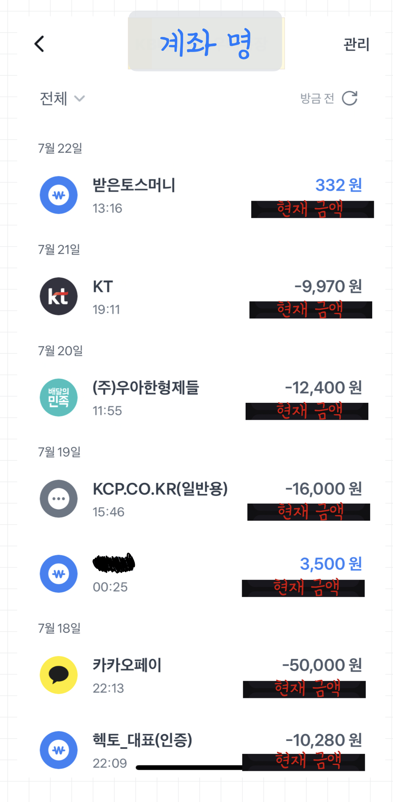

# 토이 프로젝트

# 프로젝트 주제: ‘토스’ 앱의 주요 기능을 구현해보기

## 요구사항 정리

- 회원 기능 (Member)
    - 회원 등록
    - 회원 조회
    - 회원 수정
    - 송금 횟수가 10회가 넘으면 다음 송금부터는 수수료 생김
- 계좌 기능 (Account)
    - 계좌 등록
    - 계좌 조회
    - 다른 계좌와 송금 거래
    - 계좌의 은행에서 시행하는 이벤트에 참여 가능
- 은행 기능 (Bank)
    - 은행 등록 (애플리케이션 최초 실행 시점에만 사용하고 사용하지 않는 기능)
    - 은행 조회
    - 달마다 은행 별 금리에 맞춰 계좌에 금리 지급
- 행사 기능 (Event)
    - 행사 등록
    - 행사 조회
    - 행사 취소
- 거래 기능 (Transaction)
    - 거래 등록
    - 거래 조회
    - 거래 수정 (거래에 대한 메모와 카테고리만 수정이 가능하다)
- 기타 요구사항 & 요구사항 구체화
    - 계좌 관리(조회)를 하면 최신순으로 거래한 내역들이 모두 보여야함
    - 추가로 그 달의 내역을 달력에 표시하고 그 달에 가장 많이 소비한 카테고리 알려주기
    - 계좌의 role(VIP, NORMAL)에 따라 적용되는 금리가 달라야함
    - 프로젝트를 진행하면서 더 추가할 예정…

## 데이터베이스 다이어그램

## 메인 홈페이지

## 송금 페이지 1-1 (추천 계좌 ver)

## 송금 페이지 1-2 (직접 은행 & 계좌 입력 ver)

## 송금 페이지 2

## 계좌 관리 페이지
